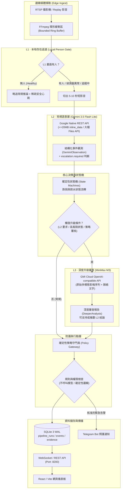

# Care Agent · 居家長照連續觀測與失能評估輔助系統

> 將長照失能評估從「點狀問卷快照」轉為「連續行為曲線」。系統萃取客觀證據，由專業照管人員進行臨床判斷。

[](LICENSE)
[](https://www.python.org/)
[](https://bun.sh/)
[](docs/measured-capabilities.md)

---

## 問題與目標

### 問題現況
現行長照 2.0 失能評估（如 CMS、巴氏量表）主要仰賴照管專員數月一次的到府訪視問卷或家屬代答。這種評估模式存在三大結構性限制：
1. **記憶與主觀偏誤**：長輩與家屬常難以精確回溯過去數週的生活自理細節（如每日飲水量、步態變化、起臥困難頻率）。
2. **訪視當天效應**：評估多發生在單一時間窗口，長輩常因外人在場而刻意支撐表現，無法反映真實常態。
3. **缺乏連續客觀證據**：失能退化往往是緩慢且非線性的過程，點狀抽樣難以提早察覺活動量遞減、用藥脫漏或輕微跌倒風險。

### 目標使用者與預期效益
- **目標使用者**：獨居或白天無人照顧的長輩、照管中心專員、到宅居家服務員。
- **核心目標**：在居家環境（如客廳、玄關、廚房冰箱周邊）透過邊緣影像與音訊事件，建立長輩個人的動態日常行為基準線（Personal Baseline）。
- **預期效益**：提供照管專員客觀、可回溯的日常生活活動能力（ADL/IADL）行為代理指標；異常時附帶結構化證據與信心度，供後續複評與精準派工參考，避免偽陽性過多造成的照護資源浪費。

---

## 核心功能

1. **三層階梯式觀測管線（L1 → L2 → L3）**
   - **L1 本地端存在閘道（Person Gate）**：以輕量偵測器（預設 YOLO11n person class）在邊緣端判定「畫面是否有人」。無人時跳過高成本雲端多模態推論（僅保留稀疏安全心跳）；偵測器異常時**強制 fail-open**，絕不將故障誤判為安全空房。
   - **L2 Gemini 3.5 Flash Lite 語意理解**：常規分析 5–10 秒短影音與事件，萃取跌倒、飲水等結構化觀測數據（`GeminiObservation`），並決定是否需要發起升級（`escalation.required`）。
   - **L3 MiniMax M3 多模態深度審查**：僅在 L2 判定語意模糊或狀態機處於高風險時啟動。MiniMax 接收原始影格序列與文字脈絡進行深度判讀，具備推翻 upstream 判斷的能力（如辨識灰階空白測試影格與 upstream 虛報的矛盾）。
2. **確定性狀態機（Deterministic State Machines）**
   - 跌倒與飲水事件皆由狀態機嚴格管理（跌倒：`idle → suspect → confirmed → recovering → resolved`；飲水：`idle → suspect → confirmed → active → completed`）。
   - 模型輸出僅作為觀測證據（Observation），無權直接宣告確診事件，防止大語言模型幻覺導致誤發通報。
3. **確定性策略守門員（Deterministic Policy Gateway）**
   - 系統唯一具備行動授權能力的模組。模型回傳的風險建議需經過預先設定的規則閥值與權限檢查，模型不可擅自決定通知對象、渠道或發送 Telegram 訊息。
4. **端到端視窗反查與完整稽核（Audit Trails）**
   - 每個視覺窗口皆在 SQLite 寫入一筆 `pipeline_runs` 紀錄，詳細留存 L1 決策、Gemini 呼叫狀態與延遲、MiniMax 深度審查紀錄、模型版本與短影音關聯引用。儀表板支援點擊任意事件反查完整判斷鏈路。
5. **完全離線啟動與零相依安裝**
   - 後端採用 Python 3.11+ 原生標準庫（不需 `pip install` 任何重型框架），初次啟動不預先下載數 GB 模型權重；支援 Windows/WSL2、macOS、Linux，並提供完整離線樁模組（Stubs）供合約驗證。

---

## 系統架構

系統由邊緣擷取、本地過濾、雲端雙模型階梯理解、確定性策略守門員與資料呈現層構成：



### 元件協作說明
- **前端介面（Frontend）**：以 React、Vite 與 Tailwind CSS 打造，提供即時影音回放、事件時間軸、三層管線運行指標（L1 略過數、L2 呼叫率、L3 升級數與延遲）及 `/setup` 設定精靈。
- **後端引擎（Backend）**：以原生 Python 標準庫實作輕量非同步 HTTP/WebSocket 伺服器，負責管理 FFmpeg 子程序、狀態機推進與雙層雲端模型非同步調度。
- **模型協作（Model Collaboration）**：
  - L1 負責零成本過濾無人靜態時段；
  - L2 Gemini 處理主要的多模態即時判讀；
  - L3 MiniMax 僅在疑難與高風險視窗啟動覆核，避免高昂運算成本與速率限制。
- **資料庫（Database）**：以本地 SQLite 3（啟用 WAL 模式）儲存結構化事件、管線運作紀錄（`pipeline_runs`）與觀察者長週期統計，所有敏感金鑰存放於 `0600` 本地金鑰儲存庫，絕不寫入資料庫記錄檔。
- **外部整合（External Services）**：支援標準 RTSP 監控串流、Telegram 照護通知長輪詢機器人，以及 Google / GMI Cloud 原生 API。

---

## 使用技術

| 類型 | 技術／服務 | 用途 |
| --- | --- | --- |
| **AI 模型 (L1)** | YOLO11n (ONNX / Stub) | 邊緣端本地人體存在快速過濾，提供遲滯、心跳與 fail-open 保護 |
| **AI 模型 (L2)** | Google Gemini 3.5 Flash Lite | 常規多模態語意理解，分析 5–10 秒短影音並產出結構化觀測值 |
| **AI 模型 (L3)** | MiniMax M3 (`MiniMaxAI/MiniMax-M3`) | 多模態深度覆核，在升級時接收原始影格與文字上下文，提供第二意見 |
| **前端框架** | React 18, Vite, TypeScript | 輕量即時長照監控儀表板、全鏈路事件追溯面板與系統配置導引 |
| **UI 樣式與圖表** | Tailwind CSS, Lucide Icons | 現代化響應式介面排版與即時狀態標示 |
| **後端核心** | Python 3.11+ (Standard Library Only) | 零 pip 相依之後端伺服器，負責狀態機、策略閘道、排程與 HTTP/WS API |
| **套件與建置工具** | Bun 1.1+ | 前端建置、管理與後端啟動工作流腳本 |
| **媒體處理** | FFmpeg 6.0+ | RTSP 視訊串流拉取、分段切片、環形緩衝區管理與影格抽取 |
| **資料庫** | SQLite 3 (WAL 模式) | 本地儲存 `pipeline_runs`、事件紀錄、量測指標與稽核足跡 |
| **Sponsor 技術** | Google Cloud / Gemini REST API | 提供 L2 高性價比之原生多模態結構化推論（支援 inline_data 與 Files API） |
| **Sponsor 技術** | GMI Cloud / MiniMax API | 提供 L3 高推理能力之多模態影像影格審查（OpenAI-compatible 介面） |

---

## 安裝與執行

本專案支援 **Windows 11 (原生與 WSL2)**、**macOS** 與 **Linux**。後端無須安裝額外 pip 套件，初次複製即可直接執行。

### 1. 環境需求
- **Python** 3.11 或以上版本
- **Bun** 1.1 或以上版本（[安裝指引](https://bun.sh/)）
- **FFmpeg** 與 **ffprobe**（指令列需可直接存取）

### 2. 下載與安裝
```bash
# 複製儲存庫
git clone https://github.com/tavricccc/buildmode2026.git
cd buildmode2026/src

# 安裝前端與腳本相依
bun install
```

### 3. 初始化資料庫與驗證
```bash
# 建立資料庫表格結構 (data/care.sqlite3)
bun run migrate

# 執行系統相依、語法與單元測試驗證
bun run verify
```

### 4. 啟動服務
```bash
# 啟動正式服務 (預設監聽 http://127.0.0.1:8200)
bun start

# 或啟動開發模式 (包含前端熱重載)
bun run dev
```

啟動後於瀏覽器開啟 `http://127.0.0.1:8200`，系統初次使用將導向 `/setup` 介面進行環境自我檢測（Camera、FFmpeg、Storage）與 API 金鑰設置。

### 5. 離線合約與模型能力探測（選填）
在未配置外部 API 金鑰時，系統預設使用離線樁（Stubs），可完整體驗所有狀態機流轉與儀表板操作：
```bash
# 驗證 Google Gemini 原生端點與 Files API 能力
bun run probe:gemini

# 驗證 MiniMax M3 多模態影格與 Token 增量能力
bun run probe:minimax
```

---

## 作品展示

- **即時監控儀表板**：
  - **三層管線面板（Pipeline Panel）**：即時呈現 L1 本地過濾、L2 Gemini 常規推論與 L3 MiniMax 深度升級之健全度、呼叫率、略過比例與延遲。
  - **狀態機時間軸（Event Timeline）**：直觀顯示長輩跌倒或飲水行為的確定性流轉過程，並標記疑點等級與時間戳。
  - **全鏈路反查（Cascade Trace）**：點選任一事件即可回溯原始短影音、L1 判斷、Gemini 觀察值、MiniMax 審查報告及最終策略決策。
- **展示影片**：
  - 本專案根目錄附有測試展示影片素材：`Bottle vs Stairs⚠️🔥 Rolling Bottles till the end ! #shorts [FlRuzGuXxC4].mp4`。
  - 評選展示影片連結：[待填寫 / 競賽展示連結]

---

## 限制與未來工作

### 已知限制
1. **單一主要場域與住戶視角**：目前管線針對單一長輩之客廳或主要生活空間進行最優化，尚未支援多鏡頭空間坐標融合。
2. **非醫療診斷器材**：系統輸出之行為指標僅供長照專員與照護者參考，不具備醫療診斷效力，且不主動觸發 119 緊急救護通報。
3. **極端光照與遮擋**：夜間無紅外夜視或遭大型家具完全遮擋時，L1 存在感測與 L2 影像分析可能因可信度不足而標記為降級模式（Degraded）。

### 未來工作
1. **多感測器跨模態融合**：整合邊緣都卜勒毫米波雷達（mmWave Radar）與微動開關，進一步降低隱私顧慮並提升睡眠與浴室場域之跌倒偵測能力。
2. **長照 2.0 機構派工系統 API 串接**：將結構化行為代理指標導出為標準長照評估匯入格式，直接輔助社工安排居服員到府查訪重點。
3. **長週期偏好摘要強化**：在邊緣端建立個人長期溝通與生活作息偏好，消除因個人生活習慣（如平時極少飲水或話少）所產生的常規誤報。

---

## 第三方服務、資料與素材

本專案遵循嚴格的資料隱私邊界，**絕不**將長輩個人可識別資訊（PII）或原始音訊逐字稿公開，儲存庫內亦不包含任何真實金鑰。

| 項目 | 來源與連結 | 授權／使用條款 |
| --- | --- | --- |
| **Google Gemini API** | [Google AI Studio](https://ai.google.dev/) | 依 Google API 服務條款使用 |
| **MiniMax M3 / GMI Cloud** | [GMI Cloud Serving](https://gmi-serving.com/) | 商業 API 授權使用 |
| **YOLO11** | [Ultralytics GitHub](https://github.com/ultralytics/ultralytics) | AGPL-3.0 License |
| **Bun** | [Bun.sh](https://bun.sh/) | MIT License |
| **FFmpeg** | [FFmpeg.org](https://ffmpeg.org/) | LGPL / GPL 依編譯選項而定 |
| **測試素材影片** | 根目錄測試 Short 影音 | 僅供學術競賽與測試驗證使用 |

---

## 團隊成員

| 姓名 | 分工項目 |
| --- | --- |
| **Tavric** | 系統整體架構設計、三層管線演算法、確定性狀態機與策略守門員實作、實測探針評測 |
| **Artificial Illusion Team** | 前端監控儀表板開發、展示重播測試情境建置、長照情境問題梳理與文件整理 |

---

## License

本專案採用 **GNU General Public License v3.0 or later (GPL-3.0-or-later)** 授權開源。完整授權條款請參閱儲存庫根目錄之 [LICENSE](LICENSE) 檔案。
