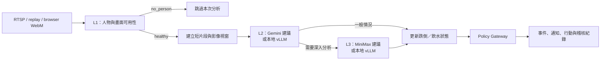

# Care Agent

Care Agent 是一套面向單一居家住民的照護監測原型，從影像串流判斷跌倒與飲水狀態，將模型結果整理成可追蹤的事件與行動紀錄。系統可以使用本地模型或雲端模型；目前建議的配置是以 Gemini 處理 L2 分析、以 MiniMax 處理 L3 分析。

[](LICENSE)
[](src/README.md)
[](src/frontend)
[](docs/architecture.md)

## 專案範圍

目前的實作聚焦在兩種照護情境：

- 跌倒：從人物出現、疑似跌倒到確認與恢復，形成可追蹤的狀態。
- 飲水：偵測拿杯、喝水與完成事件，累積當日飲水摘要。

Pipeline 會保留每次判斷的來源、時間、模型回應、狀態轉移與政策決策。維護人員可在「系統維護」頁回查一次事件是如何形成的；照護首頁只保留住民狀態、健康量測與待處理事項。模型負責提供證據，Policy Gateway 負責決定是否建立事件、發送通知或執行其他動作。

## 系統流程



三層的責任如下：

1. **L1**：先判斷畫面是否可用，以及是否有人在場。可選 `stub`、`motion` 或 `yolo11n`；新環境預設使用 `stub`，以便先啟動完整流程。
2. **L2**：分析短片段中的時間變化，處理跌倒或飲水等一般判斷。可選本地 vLLM 或雲端 Gemini。
3. **L3**：只在 L2 判斷需要時進一步分析，並把結果交回狀態機與 Policy Gateway。可選本地 vLLM 或雲端 MiniMax。

模型輸出不能直接觸發外部行動。所有行動都要經過 Policy Gateway 的規則與去重檢查。

## 模型選擇

L2 與 L3 是可切換的 provider slot，L1 則是選偵測器，兩者的設定路徑不同：

| Slot | 目前建議 | 可切換選項 | 怎麼切換 |
| --- | --- | --- | --- |
| L1 | 先用 `stub` 開發，部署時可改用 `motion` 或 `yolo11n` | `stub`、`motion`、`yolo11n` | 只能在 Settings 改（存進 SQLite 的 policy），沒有對應的環境變數 |
| L2 | 雲端 Gemini 3.5 Flash Lite | `gemini`、`local_vllm` | `L2_PROVIDER` 或 Settings |
| L3 | 雲端 MiniMax M3 | `minimax`、`local_vllm` | `L3_PROVIDER` 或 Settings |

目前建議使用雲端 provider，是因為這組配置已有對應的實作與能力量測。全新 checkout 的 runtime 預設仍是本地 vLLM，讓沒有雲端金鑰的環境可以先啟動服務；要使用建議配置時，再設定 provider 與對應金鑰即可。

本地模型預設連到 `http://127.0.0.1:8000/v1`，模型名稱為 `nemotron_omni`。雲端金鑰可以透過環境變數提供，也可以在 Settings 中寫入應用程式的 write-only secret store。詳細設定與目前量測結果請參閱 [Getting Started](docs/getting-started.md)、[Architecture](docs/architecture.md) 與 [Measured Capabilities](docs/measured-capabilities.md)。

## 快速開始

需要 Bun、Python 3.11+ 與 FFmpeg。請先安裝依賴並初始化資料庫：

```bash
cd src
bun install
bun run migrate
```

啟動 backend 與內嵌前端：

```bash
bun start
```

服務預設在 <http://127.0.0.1:8200> 提供 API 與前端。要改用 Vite 熱重載開發，先停掉 `bun start`，再跑：

```bash
CARE_BACKEND=http://127.0.0.1:8200 bun run dev
```

`bun run dev` 會同時啟動 backend 與 Vite，所以不要和 `bun start` 併用，兩個 backend 會搶 8200 port。前端這時位於 <http://127.0.0.1:5173>，API 仍由 8200 提供。`CARE_BACKEND` 一定要設：`frontend/vite.config.ts` 的預設值是 8000，忘了設就會 proxy 到本地 vLLM。

### 使用目前建議的雲端配置

在啟動前設定 provider 與金鑰。金鑰可由環境變數提供，或在前端 Settings 的 Secrets 區域設定：

```bash
export L2_PROVIDER=gemini
export L3_PROVIDER=minimax
bun start
```

如果只想驗證流程，不連接本地模型或雲端服務，可以使用 stub 模式：

```bash
bun start -- --stubs --source fall
```

可用的 replay 情境包括 `fall`、`empty_room`、`hydration` 與 `l1_false_negative`。完整的設定、資料目錄與 provider 說明請參閱 [Getting Started](docs/getting-started.md)。

## 使用介面

前端使用 React、Vite、TypeScript、原生 CSS 與 Phosphor Icons。介面採淺色主題，左側導覽分成日常照護與管理維護兩組：

- **照護總覽**：預設首頁。顯示住民目前狀態、健康量測、活動、飲水、跌倒事件與近期照護動作，可切換 1、3、7、30 天。
- **趨勢與統計**：查看每日活動與飲水走勢、健康量測歷史，以及 Observer 的逐筆觀察紀錄。
- **即時影像**：選擇 RTSP、模擬情境或本機錄影，並顯示 Ring Buffer 中最新的取樣影格。
- **系統維護**：查看 L1–L3 Pipeline、模型延遲、Policy 決策、系統日誌與 Cascade Trace。
- **初始設定／系統設定**：檢查執行環境與資料來源，切換 provider、寫入 secrets、調整 policy 或回溯設定版本。

照護總覽的期間切換同時套用在摘要、事件、健康量測走勢與 L3 分析。按「交給 L3 分析全部資料」時，後端會整理所選期間的每日彙總、健康量測、事件、Policy 動作、Observer 紀錄與 Pipeline 統計，再交給目前設定的 L3 provider。傳送內容有 30 天上限，不含 secrets、原始 SQLite 檔案或長時間原始影像。L3 回傳摘要、建議、正向訊號、注意事項與資料限制；結果只供判讀，不會直接觸發通知。

開啟前端時預設停在照護總覽，不會自動導向初始設定。即時影像顯示的是取樣影格，系統沒有錄影播放器。

## API 與資料

服務使用 Python 標準函式庫提供 threaded HTTP API 與 WebSocket。REST 路由一律掛在 `/api` 底下，沒有 `/health` 這類根路徑端點。常用端點：

| 類別 | 端點 |
| --- | --- |
| 狀態與設定 | `GET /api/status`、`GET /api/setup/state` |
| Pipeline | `GET /api/pipeline/runs`、`GET /api/observations`、`GET /api/logs` |
| 事件與行動 | `GET /api/events`、`GET /api/events/{id}`、`GET /api/actions` |
| 飲水摘要 | `GET /api/hydration/summary` |
| 健康與趨勢 | `GET /api/health/current`、`GET /api/statistics?days=7` |
| L3 期間分析 | `POST /api/observer/analyze-all` |
| Provider 與 secrets | `GET`／`PUT /api/settings`、`POST /api/settings/providers`、`POST /api/settings/rollback`、`POST /api/secrets` |
| 來源與影像 | `POST /api/source/start`、`POST /api/source/stop`、`GET /api/source/snapshot`、`GET /api/replay/scenarios`、`GET /api/media/streams` |
| 即時更新 | `WS /ws`、`WS /ws/media` |

backend 另外保留一組相容 Longcare 舊流程的端點：`/api/agent/*`、`/api/memory/*`、`/api/interaction/*` 與 `/api/transcripts`。健康、Observer 與統計端點已由新版照護總覽及趨勢頁直接使用；其中手動期間分析走目前設定的 L3 slot。完整列表見 [API Reference](docs/api-reference.md)。

資料預設寫入 `src/data`，可用 `CARE_DATA_DIR` 指定其他位置。每個實際執行的 L2 視窗都會產生對應 clip，存放在 `data/clips/`，並由 pipeline run 的 evidence reference 指向。現在尚未提供自動清理 clip 的背景工作，長時間執行時需要自行管理資料目錄。

瀏覽器 WebM 來源可以攜帶音訊，並可讓本地 vLLM client 取得音訊資料；目前沒有接入 ASR 引擎，RTSP 解碼也以影像為主，因此音訊路徑尚未形成完整的語音事件偵測流程。

## 驗證

在 `src` 目錄執行：

```bash
bun run verify
bun run build
```

`bun run verify` 會執行 Python 編譯檢查、backend unittest、前端型別檢查，以及 FFmpeg 檢查。`bun run build` 會建立前端 production bundle。需要實際雲端金鑰的 provider probes 是另外的能力測試，不會由離線 stub 流程代替。

目前 repository 的驗證結果為 128 個測試通過，前端 typecheck 與 production build 也通過。測試範圍、DoD 與 provider probes 請參閱 [Verification and Testing](docs/verification-and-testing.md)。

## 隱私與目前限制

- 原始串流不會作為長期資料庫內容保存；系統使用受限大小的近期 frame buffer。
- 若選用雲端 provider，觸發 L2/L3 事件分析的短片段會送到對應服務；手動執行 L3 期間分析時，另會傳送所選期間的結構化照護彙總與健康量測。選用本地 provider 時，模型請求留在本機。
- API 與前端目前適合在受信任的本機或內網使用，尚未提供完整的使用者登入與權限管理。
- L1 的 `yolo11n` 需要額外的 ONNX Runtime 與模型權重；系統不會在啟動時自動下載權重。
- RTSP、browser media bridge 與 replay source 的能力不同，請依 [Data and Policy](docs/data-and-policy.md) 與 [Pipeline](docs/pipeline.md) 的說明配置。

## 文件

- [文件總覽](docs/README.md)
- [Getting Started](docs/getting-started.md)
- [Architecture](docs/architecture.md)
- [Pipeline](docs/pipeline.md)
- [API Reference](docs/api-reference.md)
- [Data and Policy](docs/data-and-policy.md)
- [Measured Capabilities](docs/measured-capabilities.md)
- [Verification and Testing](docs/verification-and-testing.md)
- [Backend / Frontend README](src/README.md)

## 第三方元件

- [Python](https://www.python.org/)
- [React](https://react.dev/)、[Vite](https://vitejs.dev/)、[TypeScript](https://www.typescriptlang.org/)
- [Bun](https://bun.sh/)
- [FFmpeg](https://ffmpeg.org/)
- [Google Gemini API](https://ai.google.dev/)、[MiniMax API](https://www.minimax.io/)
- [Ultralytics YOLO](https://github.com/ultralytics/ultralytics)（選用）

## License

本專案採用 [GPL-3.0-or-later](LICENSE)。

## 團隊

Tavric / Artificial Illusion Team
