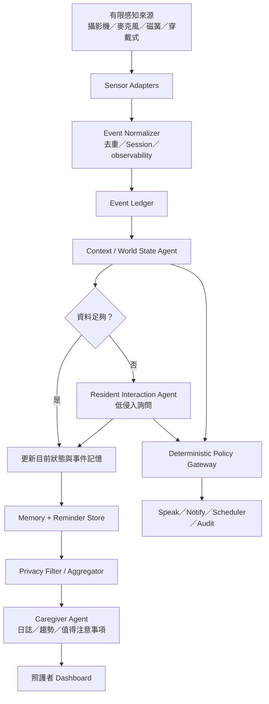

# 12 · 目標架構與 Agent 邊界

版本：v0.2 · 2026-09-04

## 1. 產品核心

本系統不是「一直看著長輩」的監控器，而是：

> 在有限資訊下，知道目前知道什麼、不知道什麼、什麼值得注意，以及什麼時候應該友善詢問。

攝影機只是有限感知來源。所有感知器都必須能表示「沒有觀測到」與「無法觀測」的差異；未知不能被當成正常，也不能被模型猜成事實。

## 2. 舊方案保留與標示

以下內容保留在 repo，供團隊理解演進，但不再是目標架構：

- ~~Frigate candidate event → 一律送 MiniMax M3。~~
- ~~Whisper 在 VAD 後持續產生 transcript，並把 transcript 存入 SQLite。~~
- ~~MiniMax M3 作為唯一高階大腦，直接操作 Memory、Speak、Notify 與 Frontend。~~
- ~~以全屋／全時段攝影機觀測作為主要產品價值。~~

新的目標是「三個邏輯 Agent + 一條確定性治理骨幹」。三個 Agent 可以共用同一個 runtime，但不共用權限、context 或輸出責任。

## 3. 目標資料流



## 4. 三個邏輯 Agent

| Agent | 主要問題 | 可以做 | 不可以做 |
|---|---|---|---|
| Context / World State Agent | 現在知道什麼？不知道什麼？ | 融合事件、更新位置／活動／感測器狀態、產生 uncertainty 與 question candidate | 直接通知照護者、直接修改緊急政策、把猜測寫成 Fact |
| Resident Interaction Agent | 是否值得現在問長輩？ | 低侵入詢問、接收回答、建立長輩確認的事件／偏好／食材記憶、提出提醒 | 24/7 逐字記錄、未經 policy 發送外部通知、擅自提高提醒頻率 |
| Caregiver Agent | 哪些資訊值得交給照護者？ | 讀取隱私過濾後的事件、產生日誌／趨勢／evidence refs、標示資料不足 | 讀取不必要的原始影音、宣稱診斷、直接改變介入門檻 |

Risk、Policy、Scheduler、Retention、Audit 是確定性支援服務，不應被包裝成可自由行動的 LLM Agent。

## 5. World State 最小契約

```json
{
  "subject_id": "resident_001",
  "observed_at": "2026-09-04T18:05:00+08:00",
  "location": {"value": "kitchen", "confidence": 0.84},
  "activity": {"value": "fridge_session", "confidence": 0.78},
  "sensor_state": {"fridge_door": "closed", "camera": "available"},
  "known": ["fridge_opened", "fridge_closed"],
  "unknown": ["items_added_to_fridge"],
  "observability": "unobservable",
  "question_candidate": {
    "topic": "fridge_items",
    "reason": "post-close image is insufficient",
    "intrusion_level": "low"
  },
  "evidence_refs": ["evt_20260904_000123"],
  "schema_version": "world_state.v1"
}
```

## 6. Model Runtime 與 vLLM

本機 vLLM 是主要推論入口；Agent 不直接依賴 provider API，而是呼叫統一的 `ModelRuntime`：

```text
ModelRuntime.generate(
  task,
  context_snapshot,
  evidence_refs,
  output_schema,
  deadline,
  privacy_scope
)
```

- Context Agent：優先使用本地 vLLM 或規則，輸出 World State JSON。
- Resident Agent：優先使用本地 vLLM，僅在對話窗內接收 transcript。
- Caregiver Agent：使用聚合後的結構化資料，不需要原始影音。
- MiniMax 若保留，應是特定 VLM 任務的可選 provider，不能直接擁有通知、政策或任意 SQL 權限。

所有模型輸出都必須經 schema、evidence、confidence、provenance 與 scope 驗證。

## 7. 隱私與事件規則

- 攝影機只配置在玄關、客廳或冰箱等明確場域，不宣稱全屋監控。
- VAD 可做本地存在性判斷；ASR 只在 `speak(expect_reply=true)` 開啟的 conversation window 內執行。
- transcript 只存在短期記憶體 buffer；SQLite 只保存對話中繼資料與長輩確認後的 Fact。
- 原始影像／音訊不可直接進 Caregiver Agent；照護者只看到必要摘要與 evidence reference。
- reminder、notify、cooldown、TTL、L0–L4 都由 deterministic service 執行。

## 8. Demo 驗收路徑

1. 產生「長輩在廚房、冰箱開關完成」事件。
2. World State 顯示已知事件與 `items_added = unknown`。
3. Resident Agent 產生低侵入問題。
4. 長輩回答後，保存食材類別、時間與確認來源。
5. Scheduler 建立保存期限提醒。
6. Caregiver Agent 以模擬一週資料產生日誌與一項趨勢。
7. 另用 replay 展示異常事件、check-in、無回應與人工隊列。

Demo 的重點是「系統知道自己的不知道」，而不是展示攝影機拍得多完整。
