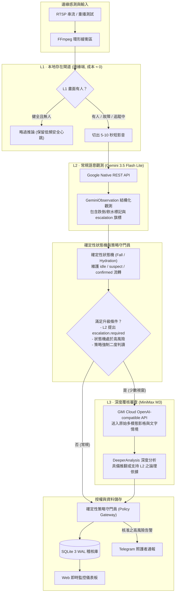

# 系統核心架構與設計原則 (Architecture)

Care Agent 旨在解決高齡獨居長輩之居家安全防護與失能趨勢觀測。系統的核心技術理念為：**「模型提供證據、規則把關動作、人做臨床決策」**。

早期的系統架構常試圖將所有模型包裝在單一的「OpenAI 相容伺服」抽象層後，這種做法代價高昂：既抹煞了不同多模態模型（如 Google 原生 REST 與 Files API）的原生特長，又迫使系統在每個觀測視窗都必須負擔最昂貴的運算成本。Care Agent 將管線重構為三層固定職責鏈路，各自承擔性價比最佳的工作。

---

## 三層級聯架構 (Three-Tier Cascade)



---

## 程式碼確保不可逾越的三大原則

### 原則一：偵測器故障絕不等於空房 (Fail-Open)
在 `backend/domain/l1_contract.py` 中，`L1Decision` 定義為四值列舉：
- `person_present`：畫面確認有人。
- `no_person`：畫面確認無人。
- `stale`：偵測器逾時未更新。
- `unavailable`：偵測器崩潰或離線。

全系統僅有單一斷言函式 `L1Decision.permits_skip()`。單元測試強制驗證：**四個狀態中僅有健全且新鮮的 `no_person` 會回傳 `True`**。任何偵測器逾時、當機、啟動冷開機或例外狀態，皆一律「Fail-Open」放行至 L2 進行安全檢查，絕不冒險將故障當作無人處理。

### 原則二：模型負責提供觀測證據，策略守門員負責採取行動
大語言模型與多模態模型本質具備隨機性與潛在幻覺。在資料契約 `DeeperAnalysis`（L3 合約）中：
- **完全不存在 `recipient`、`channel` 或 `threshold` 等操作欄位**。
- 模型無權決定通報閾值，更無權直接向 Telegram Bot 或外部網路發送警報。
- 當 L3 模型建議「應立即聯繫家屬」，但系統設定之 `notify_on_l3_high_risk` 旗標未啟用時，策略守門員會將該建議降級為儀表板通知，並記錄降級原因代碼 `l3_advisory_not_authorised`。降級過程完全記錄於日誌，絕不靜默忽視。

### 原則三：每一個觀測視窗皆可事後精確回溯
每個被處理或被跳過的 5–10 秒視窗，均在 `pipeline_runs` 資料表寫入一筆完整紀錄：
- 記錄 L1 判斷狀態與信心度；
- 記錄 L2 呼叫原因、略過原因、延遲與回傳觀測；
- 記錄 L3 是否觸發、是否因影音缺失降級為純文字、模型耗時；
- 記錄當時啟用的模型版本、設定版本與對應之短影音證據檔案雜湊。
使用者在儀表板點選任一異常事件，即可循線還原整個推論鏈路。

---

## 確定性狀態機設計 (State Machines)

模型輸出的結果僅稱為「觀測（Observation）」，而非「確診事件（Confirmed Event）」。狀態流轉由確定性狀態機嚴格把關：

### 1. 跌倒狀態機 (FallStateMachine)
```text
[idle] 
   │ 偵測到疑似倒地 / 劇烈位移觀測
   ▼
[suspect] ──(持續未恢復 + 高風險 follow-up)──> [confirmed]
   │                                              │
   │ 恢復正常活動                                 │ 進入救援或起身
   ▼                                              ▼
[idle]                                       [recovering] ──> [resolved]
```
- **保護機制**：當狀態進入 `suspect` 或 `confirmed` 時，系統會**強制繞過 L1 存在感測器**，每個視窗均強制 L2 追蹤長輩起身狀態，防止長輩倒臥地面不動時被 L1 判定為靜態無人。

### 2. 飲水狀態機 (HydrationStateMachine)
```text
[idle] ──> [suspect] ──> [confirmed] ──> [active] ──> [completed]
```
- 只有流轉至 `completed` 之飲水週期才會計入每日累計飲水量，避免長輩拿起水杯後放下即被重複計數。

---

## 邊緣隱私防線與安全邊界

1. **原始影音不出本機**：
   - 本地 FFmpeg 環形緩衝區僅保留數十秒的視訊片段。
   - 僅在有人或故障時，抽取 5–10 秒之短影音上傳至經過加密通道之雲端模型 API。
2. **多模態影格隔離**：
   - L3 深度審查接收之影格序列為定格取樣（預設 10 幀），不傳送完整原始碼流。
3. **長期偏好與通報欄位隔離**：
   - 共享生活偏好層僅讀取結構化特徵，機構端溝通介面僅接收行為異常指標與結構化證據，絕不暴露長輩個人生活瑣事或未去識別化之音訊逐字稿。
